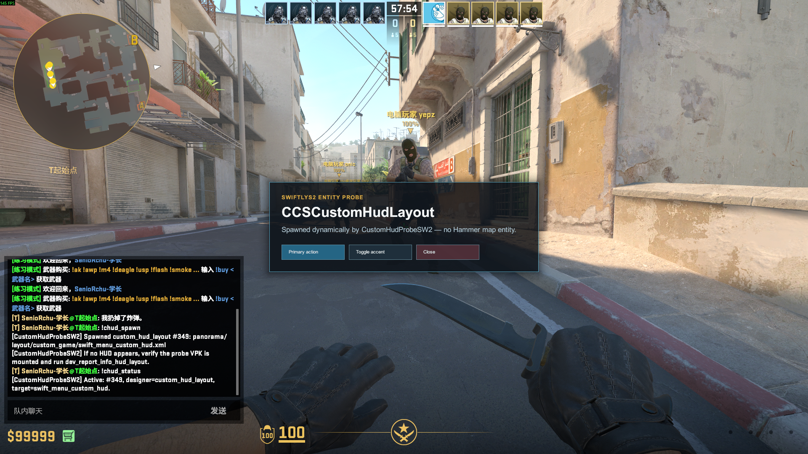

# CustomHudProbeSW2

[中文说明](README_CN.md)

`CustomHudProbeSW2` is a SwiftlyS2 proof-of-concept for CS2's experimental
`custom_hud_layout` entity. It creates the HUD entity dynamically on a running
server, with no Hammer workflow or pre-placed map entity.

## In-game preview



## What it validates

- `!chud_spawn` creates and displays the HUD probe.
- `!chud_status` reports the entity tracked by the plugin.
- `!chud_clear` removes the HUD probe.
- The client resolves and displays the HUD resources delivered by the resource VPK.
- The native `CustomHudClickedReceiver` routes the three button IDs to the
  owning player's menu: primary updates its status, secondary applies its accent,
  and close releases its input capture and collapses the panel.
- The native bridge resolves its four build-specific addresses through the
  plugin's `resources/gamedata/signatures.jsonc`, not hard-coded C# patterns.

## Quick start

Install .NET 10 SDK and a SwiftlyS2 runtime compatible with your server, then run:

```powershell
.\build_and_deploy.ps1 -ServerRoot F:\csgoserver_win\cs2
```

The plugin is published to
`<ServerRoot>\game\csgo\addons\swiftlys2\plugins\CustomHudProbeSW2\`.

## Distribution

The HUD resource is published on the Steam Workshop:
[Workshop item 3789924061](https://steamcommunity.com/sharedfiles/filedetails/?id=3789924061).

The intended production distribution route is
[SwiftlyS2 AddonsManager](https://github.com/SwiftlyS2-Plugins/AddonsManager), which
downloads and mounts the Workshop Addon for the server and its players. Setup and
verification steps are in the development guide below.

## Development documentation

See the [English development guide](docs/DEVELOPMENT.md) for plugin deployment,
Workshop publishing, `gameinfo.gi` configuration, local testing, and troubleshooting.

## Status

The dynamic entity, resource path, per-player state, input capture, and native
click receiver are implemented against SwiftlyS2 1.4.6-beta.8. A CS2 update
requires the plugin GameData signatures to be revalidated before the HUD will
spawn; a verified signature-only update does not require changing C#.
