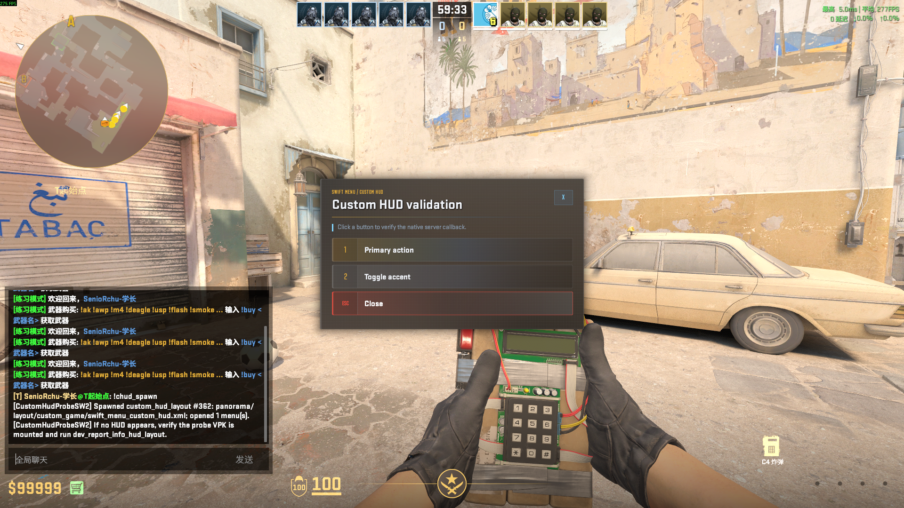

# CustomHudProbeSW2

[中文说明](README_CN.md)

`CustomHudProbeSW2` is a SwiftlyS2 proof-of-concept for CS2's experimental
`custom_hud_layout` entity. It creates the HUD entity dynamically on a running
server, with no Hammer workflow or pre-placed map entity.

## In-game preview



[View the complete Card / Gallery / Flip showcase](docs/SHOWCASE.md).

## What it validates

- `!chud_spawn menu` loads the button-menu layout into the single probe entity; omitting the argument defaults to `menu`.
- `!chud_spawn card` switches the single probe entity to the standalone 3D-card layout.
- `!chud_spawn gallery` switches to a three-image gallery with independent eight-zone 3D hover and moving shine effects.
- `!chud_spawn flip` switches to the new coral/bisque two-sided flip card; aliases are `flipcard` and `turn`.
- `!chud_open` reopens the currently loaded HUD for the issuing player.
- `!chud_close` hides the current HUD and releases the issuing player's input capture.
- `!chud_status` reports the entity tracked by the plugin.
- `!chud_clear` removes the HUD probe.
- The client resolves and displays the HUD resources delivered by the resource VPK.
- The native `CustomHudClickedReceiver` routes the three button IDs to the
  owning player's menu: primary updates its status, secondary applies its accent,
  and close releases its input capture and collapses the panel.
- The native bridge resolves its four build-specific addresses through the
  plugin's `resources/gamedata/signatures.jsonc`, not hard-coded C# patterns.

## Acknowledgements

The original direction for native Custom HUD button handling was informed by
[laper32/PanoramaLayout](https://github.com/laper32/PanoramaLayout), especially
its `CS_UM_CustomHudClicked` receiver flow. Thank you to its author for
publishing that work.

The Hover 3D gallery is adapted from the
[daisyUI Hover 3D Card example](https://daisyui.com/components/hover-3d/). Its
three demo images are the stock `card-1.webp`, `card-2.webp`, and `card-3.webp`
assets referenced by that example and converted locally to Panorama textures.

The flip card is adapted from
[Uiverse.io `little-goat-24` by `joe-watson-sbf`](https://uiverse.io/joe-watson-sbf/little-goat-24).
Its browser HTML/CSS was translated to the declarative Panorama Custom HUD
surface while retaining the original dimensions, palette, and hover behavior.

## Quick start: local override test

The plugin and HUD resource are separate artifacts. A local test needs both:

- .NET 10 SDK and a SwiftlyS2 runtime compatible with the server;
- a local CS2 installation containing `resourcecompiler.exe`;
- [VPKEdit CLI](https://github.com/craftablescience/VPKEdit), used to pack the
  resource VPK.

From the project root, set the paths for your machine and deploy the plugin:

```powershell
$serverRoot = 'F:\csgoserver_win\cs2'
$cs2Root = 'F:\Program Files (x86)\Steam\steamapps\common\Counter-Strike Global Offensive'
$vpkEditCli = 'D:\Tools\VPKEdit\vpkeditcli.exe'

.\build_and_deploy.ps1 -ServerRoot $serverRoot
```

The plugin is published to
`<ServerRoot>\game\csgo\addons\swiftlys2\plugins\CustomHudProbeSW2\`.

Build and mount the local resource override. `Install` requires the VPK produced
by `Build`:

```powershell
.\tools\build_hud_resources.ps1 -Action Validate
.\tools\build_hud_resources.ps1 -Action Build -Cs2Root $cs2Root -VpkEditCli $vpkEditCli
.\tools\build_hud_resources.ps1 -Action Install -Cs2Root $cs2Root -ServerRoot $serverRoot
```

`Install` copies the same VPK to both the client `<Cs2Root>\game\csgo\overrides\`
and server `<ServerRoot>\game\csgo\overrides\`, verifies both SHA-256 hashes,
and adds the search path to both `gameinfo.gi` files. It creates
`gameinfo.gi.swift_custom_hud_layout_probe.bak` once, so the mount can be
reverted by restoring that backup after the relevant CS2 process is stopped.

In the server console, reload the deployed plugin (or restart the server):

```text
sw plugins reload CustomHudProbeSW2
```

Then join the test server and use these chat commands:

| Command | Effect |
| --- | --- |
| `!chud_spawn menu` | Loads the button menu into the single probe entity; omitting the argument defaults to `menu`. |
| `!chud_spawn card` | Replaces the old mode and loads the standalone 3D card into the single probe entity. |
| `!chud_spawn gallery` | Replaces the old mode and loads the three-image Hover 3D gallery. Aliases: `hover3d`, `images`. |
| `!chud_spawn flip` | Replaces the old mode and loads the two-sided flip card. Aliases: `flipcard`, `turn`. |
| `!chud_open` | Reopens the current HUD for the invoking player; the probe must already exist. |
| `!chud_close` | Hides the current HUD and releases the invoking player's input capture. |
| `!chud_status` | Reports the bridge and probe entity state. |
| `!chud_clear` | Removes the probe and releases its input capture. |

Restart the local CS2 client/server after mounting a new override VPK. The local
override is only for development; use the Workshop route below for production.

## Distribution

The HUD resource is published on the Steam Workshop:
[Workshop item 3789924061](https://steamcommunity.com/sharedfiles/filedetails/?id=3789924061).

The intended production distribution route is
[SwiftlyS2 AddonsManager](https://github.com/SwiftlyS2-Plugins/AddonsManager), which
downloads and mounts the Workshop Addon for the server and its players. Setup and
verification steps are in the development guide below.

## Development documentation

See the [English development guide](docs/DEVELOPMENT.md) for command parameters,
plugin deployment, Workshop publishing, `gameinfo.gi` configuration, local testing,
and troubleshooting.

## Status

The dynamic entity, resource path, per-player state, input capture, and native
click receiver are implemented against SwiftlyS2 1.4.6-beta.8. A CS2 update
requires the plugin GameData signatures to be revalidated before the HUD will
spawn; a verified signature-only update does not require changing C#.
