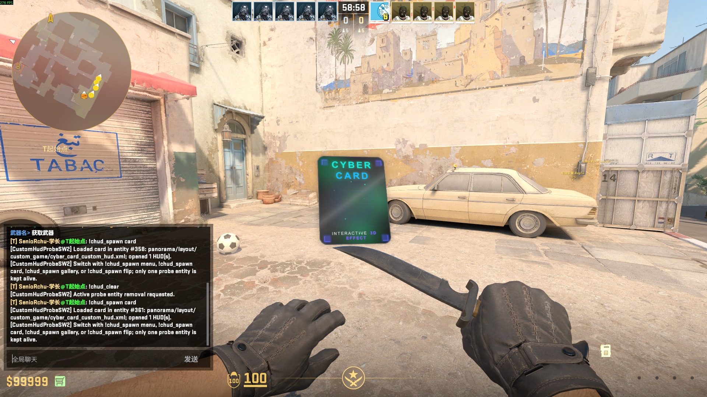
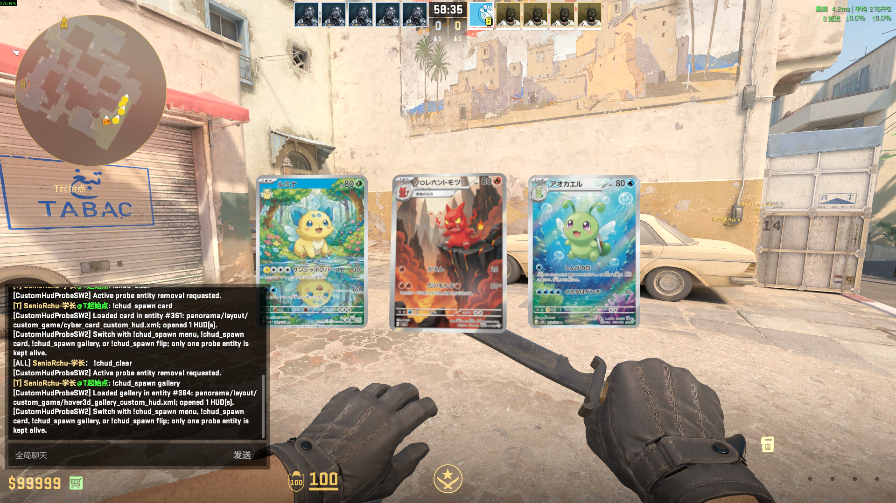
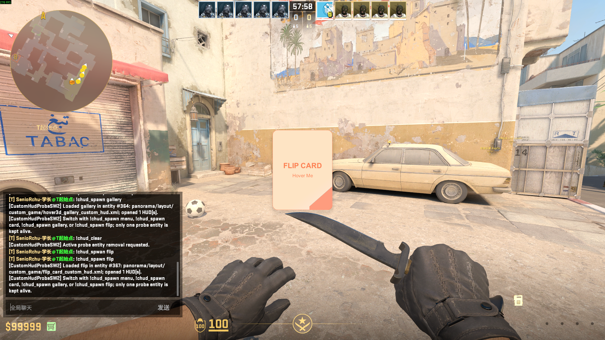

# In-game showcase

[中文效果展示](SHOWCASE_CN.md) · [Back to README](../README.md)

This page collects the larger in-game screenshots separately so the main README stays compact. All three examples are rendered by Panorama on a world-space HUD panel in Counter-Strike 2.

| Mode | Chat command | Interaction |
| --- | --- | --- |
| Cyber Card | `!chud_spawn card` | Hover-driven 3D tilt and lighting |
| Hover 3D Gallery | `!chud_spawn gallery` | Individual card hover and depth response |
| Flip Card | `!chud_spawn flip` | Front/back flip on hover |

## Cyber Card

The Cyber Card demonstrates layered borders, glow, highlights, particles, and pointer-responsive 3D motion on a single panel.

## Hover 3D Gallery

The gallery places three independently animated cards in the same world-space HUD and preserves their spacing and depth while the player moves the pointer between them.

## Flip Card

The Flip Card switches cleanly between its front and back faces during a horizontal hover flip, with rounded corners and a stable gradient throughout the transition.

